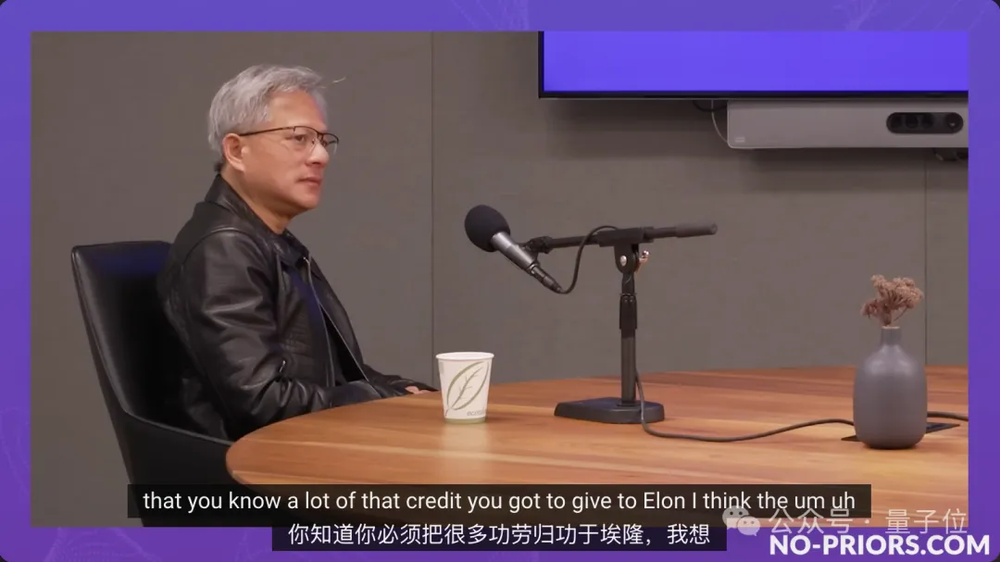
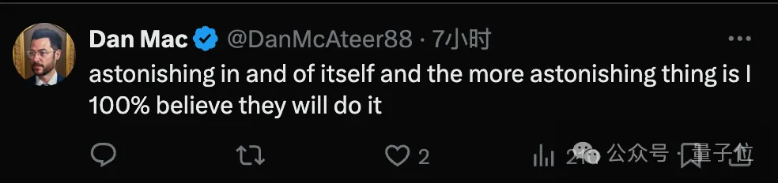
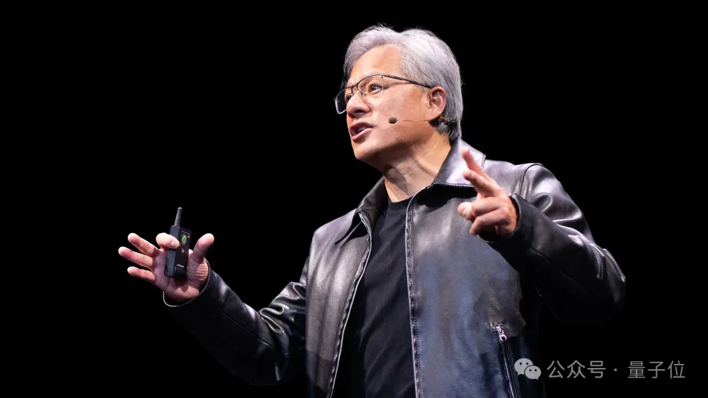

# 黄仁勋：AI算力集群会扩展到100万芯片，没有任何物理定律可以阻止
> 关注前沿科技 量子位 2024年11月08日 12:34 北京
> 梦晨 发自 凹非寺
> 量子位 | 公众号 QbitAI
英伟达市值重回第一之际，黄仁勋再次接受采访。

除了谈自己和英伟达，还吹了一波马斯克，再再再次赞赏xAI只花19天建起10万卡H100超级集群。

传闻英伟达正在考虑投资xAI，或许此言不虚。

在这场访谈中他提出，没有任何物理定律可以阻止AI数据中心扩展到一百万芯片。

> 这很难，但重新发明智能的回报太大，无法不去尝试。

为此他还提出了超级摩尔定律，从每两年性能翻倍，变成每年翻两到三倍。

并指路了具体实现途径，软硬件协同设计和数据中心级创新。

围观网友表示：很惊人，但更惊人的是我毫不怀疑他们真的能做到。

这是老黄第二次参加访谈节目No Priors，距离上次时隔一年。

在这场36分钟的访谈中，老黄还透露了更多行业内幕和对未来的设想：

- 摩尔定律的两个基本技术支柱已经遇到瓶颈

- ChatGPT正在旧的训练集群上做推理，英伟达基础设施可以在训练和推理中相互转换

- 英伟达不直接把数据中心当产品销售，但必须像对待产品一样对待它

- xAI迅速建起超级集群主要归功于马斯克的意志力和执行力

- 英伟达内部高度依赖AI芯片设计，如果没有AI，造不出Hopper架构

- 半导体行业并不是关于制造芯片，而是关于为社会构建基础结构

- AI智能体不会干掉SaaS，SaaS销售专业智能体会带来繁荣发展

- 两三年后，每篇论文、每项科学和工程突破都会以AI

- 老黄现在每天学习任何东西都会先用AI，即使是最基础的事实也会用AI反复核查

……

以下是采访全文编译整理。

## 全文整理

### 英伟达未来十年的赌注

**主持人：**

英伟达已经走过了30年，展望未来的十年，您认为还有哪些重要的赌注需要下？接下来是否只需扩大规模？在从现有架构中榨取更多计算和内存方面，我们是否遇到了限制？您目前的关注重点是什么？

**黄仁勋：**

如果退一步思考我们所取得的成就，我们已经从编程走向了机器学习，从编写软件工具到创建一个全新的生态系统。

所有这些最初都运行在为人类编程设计的CPU上，如今则运行在为AI编程设计的GPU上，主要是机器学习。

世界已经改变，我们进行计算的方式、整个技术栈都发生了变化。

我们能够解决的问题的规模也发生了巨大变化，如果你能在一块GPU上并行化你的软件，你就为在整个集群、甚至多个集群或数据中心上并行化奠定了基础。

我认为，我们已经为将计算扩展到无人想象过的水平做好了准备，并在这个水平上开发软件。

接下来的十年里，我们希望每年在整体规模上（而非单个芯片上）将性能提升两到三倍，从而使成本和能耗每年降低两到三倍。

当你每年都翻倍或三倍增长，几年下来，这种复合增长会非常惊人。

我们能超越人们对摩尔定律的理解，即每两年性能翻倍，我们将进入某种“超级摩尔定律”的曲线。

### 如何超越摩尔定律

**主持人：**

你认为是什么让这一切比摩尔定律发生得更快？我知道摩尔定律有点自我实现的性质，先提出了这个想法，然后人们努力去实现它。

**黄仁勋：**

（摩尔定律）有两个基本的技术支柱。一个是Dennard Scaling，另一个是Carver Mead’s VLSI Scaling。

这些都是严格的方法，但相关技术确实已经到了瓶颈。因此，我们现在需要一种新的扩展方式。

首先，新的缩放方式显然涉及到（软硬件）协同设计。

除非你能修改或改变算法以反映系统的架构，或者改变系统以适应新软件的架构，来回迭代，否则你毫无希望。

但如果你能同时控制这两方面，你就可以做一些事情，比如从FP64到FP32，再到BFLOAT，再到FP8，甚至FP4，甚至更小的精度。

所以我认为，协同设计是其中非常重要的一部分。

第二部分，我们称之为全栈优化，是数据中心级别的创新。

我们现在处理的大多数计算挑战，其中一个最令人兴奋的当然是推理时间的扩展，基本上是以极低的延迟生成token，进行树搜索，链式思维，可能在脑海中进行一些模拟，反思自己的答案。

AI将自我提示，默默地生成文本，并希望在一秒钟内做出响应。唯一能做到这一点的方法是你的延迟极低。

与此同时，数据中心仍然需要产生高吞吐量的token，因为你仍然希望降低成本，保持高吞吐量，实现回报。

这两个基本要求——低延迟和高吞吐量——是彼此矛盾的。

为了创造在两者上都非常出色的东西，我们必须去发明一些新东西，NVLink正是我们实现这一目标的方式。”

### 训练和推理基础设施的相互转换

**主持人：**

您的大客户中，有多少人在考虑基础设施在大规模训练和推理之间的相互转换？

**黄仁勋：**

现在的基础设施是解耦的。

Sam（Altman）刚刚告诉我，他最近退役了Volta。他们有Pascal，有Ampere，各种不同配置的Blackwell即将到来。

有些是为风冷优化的，有些是为液冷优化的，你的服务需要利用所有这些。

英伟达的优势在于，今天为训练构建的基础设施，明天将非常适合用于推理。我相信，大部分的ChatGPT服务都是在最近用于训练的同类型系统上进行推理的。

如果你能在上面训练，你就能在上面推理。

你完全有信心这些投资会得到回报，然后投入新的基础设施来扩大规模。

而且英伟达和整个生态系统将致力于改进算法，使你的基础设施在短短一年内性能提高五倍，这种进展永远不会改变。

因此，人们将这样看待他们的基础设施：

是的，尽管今天为训练而构建它，同时会知道它将在推理方面也会非常出色。

而推理将是多尺度的。

首先，为了蒸馏出更小的模型，拥有一个更大的模型作为源头是很好的。因此，你仍然会创造这些令人难以置信的前沿模型，它们将用于开创性的工作，用来生成合成数据，用大模型来教授小模型，蒸馏出更小的模型。

但最终，你会有从巨型到小型的各种模型。小型模型将在特定任务上非常有效，虽然泛化能力不如大模型，但在那个任务上表现非常出色。我们将在一个小小的领域中看到超越人类的任务，由一个小小的模型完成。也许这不是一个小语言模型，而是一个微型语言模型，Tiny Language Model，或者其他什么。

所以我认为我们会看到各种大小的模型，我们的希望是，就像今天的软件一样。

### 构建和交付完整的数据中心

**主持人：**

英伟达为客户提供的支持正在像更大的规模发展，从单个芯片到服务器，再到机架，再到NV72，您如何看待这一进程？接下来会是什么？英伟达是否应该做整个数据中心？

**黄仁勋：**

事实上，我们确实构建了完整的数据中心。

我们的做事方式是，如果你要开发软件，你需要完整形式的计算机。我们不会只做幻灯片演示然后交付芯片，我们构建整个数据中心。

在完成整个数据中心之前，你怎么知道软件是否正常工作？在整个数据中心建成之前，你怎么知道你的网络是否正常工作，以及你期望的效率是否达到了？

这就是为什么通常看到某些产品的实际性能远低于他们在幻灯片上展示的峰值性能的原因。

计算已经不像过去那样。我常说，新的计算单位是数据中心。

对于我们来说，这就是你必须交付的东西，这就是我们现在构建的东西，我们构建整个系统，并且以完整的形式构建它。

然后以各种组合进行测试，风冷的x86，液冷的Grace，以太网，Infiniband，加上NVLink，不加NVLink，等等。

我们构建每一种配置，我们公司现在有五台超级计算机，明年我们很容易再建五台。

如果你对软件很认真，你就会构建自己的计算机，并且我们以“数据中心即产品”的方式构建它们。

尽管我们不直接销售数据中心作为产品，但我们必须像对待产品一样对待它。

关于它的规划、建立、优化、调整、保持运行的一切，目标是让它像打开你的崭新iPhone一样，一切都能正常工作。

当然，这背后有技术的奇迹，但我们现在有能力做到这一点。

因此，如果你对数据中心感兴趣，只需要给我一个空间，一些电力和冷却系统，我们将在30天内帮助你建立起来。这是非常了不起的。

### xAI的超级集群

**主持人：**

最近有一个令人印象深刻的案例，就是你们为xAI迅速建立了一个集群。如果你愿意，请谈谈这个案例，因为无论是规模还是速度都令人震惊。

**黄仁勋：**

很多功劳要归功于马斯克。

首先，决定去做这件事，选择场地，引入冷却和电力，然后决定建立一个拥有10万个GPU的超级集群，这是有史以来最大的规模。

然后倒推日程，我们一起规划他要启动系统的日期，这个日期是在几个月前确定的。

所有的组件、OEM、系统、我们与他们团队的软件集成、所有的网络模拟，我们都预先以数字孪生的方式模拟了他的网络配置。我们预先准备了他的供应链，预先安排了所有的网络布线。我们甚至建立了一个小规模的版本作为参考，以便在所有设备到达之前进行测试。

到所有设备到达的时候，一切都已经准备就绪，所有的练习都完成了，所有的模拟都完成了，然后是大规模的集成，庞大的团队在一起昼夜不停地工作，几周内集群就启动了。

这真的是他（马斯克）的意志力和他能够思考机械、电气问题并克服巨大障碍的证明。

**主持人：**

如果你展望未来，达到20万、50万、100万的超级集群，您认为最大的障碍是什么？资本、能源、供应？

**黄仁勋：**

你刚才提到的这些因素，没有一件是轻松的。

是否值得追求这样的规模扩展？毋庸置疑是值得的。

要达到我们想象中的那种计算机，能够轻松地完成我们要求它做的事情，具有某种通用智能。甚至我们可以争论它是否真的具有通用智能，但即使接近它也是一个奇迹。

我认为有五到六个团队在努力尝试实现这一目标，有OpenAI、Anthropic、xAI，当然还有谷歌、Meta、微软等公司。

这个前沿领域，在攀登这座山峰的过程中，接下来的几步是至关重要的。谁不想成为登上这座山峰的第一人？

我认为，重新发明智能的奖赏太过重要，无法不去尝试。

我认为，没有物理定律的限制，但一切都会很难。

### AI芯片设计和英伟达的运作方式

**主持人：**

一年前，当我们一起交谈时，我们问过您，英伟达在人工智能和其他领域中，您对哪些应用程序最感兴趣，接下来将为客户提供哪些服务，您谈到了您最极端客户的一些科学应用。

在过去的一年中，这已经成为更主流的观点。人工智能在科学中的应用是否依然最令您兴奋？

**黄仁勋：**

我很高兴在英伟达有AI“芯片设计师”，有AI“软件工程师”。

它们非常高效，如果没有它们，我们无法构建Hopper。

它们与人类相比可以探索更大的空间，因为它们有无限的时间，它们在超级计算机上运行。我们的人类工程师时间有限，无法探索尽可能多的空间，也无法组合地探索空间。

我无法在自己探索的同时，涵盖你的探索和其他人的探索。

我们的芯片如此之大，它们并不是作为一个芯片设计的，而是像一千个芯片那样设计的。我们必须分别优化每一个。

你真的想要优化更多的模块，跨模块协同设计，优化更大的空间。

没有人工智能，我们的工程师无法做到，我们没有足够的时间。

**主持人：**

自从我们上次交谈以来，还有一件事发生了变化。我查了一下，当时英伟达的市值约为5000亿美元，如今已超过3万亿美元。在过去的18个月里增加了2.5万亿美元的市值，相当于每月增加了1000多亿美元。

今天早些时候我来到英伟达公司，感受到了公司的活力，就像15年前我在谷歌时一样，能感受到公司的能量和兴奋。

在这段时间里，有什么变化吗？或者说，有什么不同之处，无论是英伟达的运作方式，还是您对世界的看法，或者您可以采取的赌注的规模？

**黄仁勋：**

公司无法像股价那样快速变化，所以在很多方面，我们并没有太大改变。

我认为，我们需要退一步，问问自己，我们在做什么？

从行业角度来看，我们重新发明了计算。它已经60年没有被重新发明过了，这是一件多么重要的事情。

在过去的10年里，我们将计算的边际成本降低了大约一百万倍，以至于我们可以说，让计算机去穷举地编写软件吧。

某种程度上，我们可以说，我们也在芯片设计中说了同样的话。我们希望计算机去发现一些我们自己无法做到的关于芯片的东西，探索我们的芯片，并以我们无法做到的方式优化它。

因此，人们开始意识到，我们重新发明了计算。

但这究竟意味着什么？突然之间，我们创造了一个称为“智能”的东西，那么计算发生了什么变化呢？

我们从数据中心开始。

数据中心是存储文件的多租户场所。而我们正在创建的新型数据中心并不是传统的数据中心。它们不是多租户的，往往是单租户的。它们不存储任何文件，只是在生成一些东西——它们在生成tokens。

这些tokens被重新组合成看似智能的东西，而这种智能有各种不同的形式，可能是机器人的动作表达，可能是氨基酸的序列，可能是化学链，或者各种有趣的东西。

那么，我们究竟在做什么？我们创造了一种新工具，一种新的机器，在很多方面，它是“生成式人工智能”这个形容词的名词形式。

与其说是生成式人工智能，不如说是一个人工智能工厂。它是一个生成人工智能的工厂，而且我们正在以极大的规模来实现这一点。

人们开始意识到，这可能是一个新行业。它生成tokens，生成数字，但这些数字以相当有价值的方式组成。那么，哪些行业会从中受益？

然后，你再退一步，问自己英伟达在做什么。

一方面，我们重新发明了我们所知道的计算，因此有价值数万亿美元的基础设施需要现代化，这是其中一层。

更大的层面是，我们正在构建的这个工具不仅仅是为了我们正在现代化的数据中心，而是用于生产一些新的商品。这个新商品行业能有多大？很难说，但可能价值数万亿美元。

所以，如果你退一步看，我们不再制造计算机了，我们在制造工厂。

每个地方都需要它，每个公司都需要它。你能举出一个公司或行业说“你知道吗，我们不需要生产智能，我们已经拥有足够多了”吗？

所以，我认为这是一个重大理念，这是一种抽象的产业视角。

有一天，人们会意识到，在很多方面，半导体行业并不是关于制造芯片，而是关于为社会构建基础结构。然后，突然之间，大家都会说：“啊，我明白了，这是件大事。”

### 具身智能

**主持人：**

您现在如何看待“具身化”？

黄仁勋：

我非常兴奋的一点是，在很多方面，我们接近于人工通用智能，但我们也接近于人工通用机器人。token就是token，问题是你能否将其token化。

当然，正如你们所知，token化并不容易。但如果你能够将事物token化，与大型语言模型和其他模态对齐，假如可以生成一个视频，内容是我伸手去拿咖啡杯，为什么我不能提示机器人生成能够拿起咖啡杯的token呢？

直觉上，你会认为对于计算机来说，问题陈述是相当相似的。所以，我认为我们非常接近了，这令人难以置信的兴奋。

现在，有两个“棕地”（Brownfield）机器人系统——“棕地”意味着你不需要改变环境——即自动驾驶汽车和具身机器人。

通过汽车和人形机器人，我们实际上可以在不改变世界的情况下将机器人带到世界上，因为我们已经为这两样东西构建了世界。

也许马斯克专注于这两种形式的机器人并非巧合，因为它们可能具有巨大的潜在规模。

所以，我认为这是令人兴奋的，但其数字版本同样令人兴奋。

我们正在谈论的是数字员工或AI员工。毫无疑问，我们将拥有各种各样的AI员工。未来将拥有生物智能和人工智能，我们以相同的方式去提示（Prompt）它们。

我大多数时候都是提示我的员工，向他们提供背景，要求他们执行任务，他们会去招募其他团队成员，然后回来，我们来回沟通。这与各种AI员工有何不同呢？

所以，我们将拥有人工智能营销人员、人工智能芯片设计师、人工智能供应链人员等等。

我希望有一天，英伟达在生物智能层面上变得更大，但在人工智能层面上变得大得多。这是我们未来的公司。

主持人：

如果我们一年后再来和您交谈，您认为公司哪个部分最具人工智能化？

黄仁勋：

我希望是芯片设计，这是最重要的部分。因为它对我们的影响最大，也是我们可以产生最大影响力的地方，这是一个极其困难的问题。

我们与Synopsys和Cadence合作。我完全可以想象他们拥有AI芯片设计师给我租用，他们对特定的模块有所了解，熟练使用特定的工具，我们将根据需要雇佣一大批他们的人工智能设计师，在芯片设计的对应阶段帮助我们。

也许我会租用一百万个Synopsys的工程师来帮助我，然后再租用一百万个Cadence的工程师来帮助我。对他们来说，这是一个多么令人兴奋的未来，他们拥有所有这些智能体，在他们的工具平台之上并与其他平台协作。

你也会在SAP和ServiceNow那里这样做。人们说这些SaaS平台将被颠覆，我实际上认为相反，他们正坐在金矿上，如Salesforce、SAP等将因专业智能体繁荣发展。

Salesforce有Lightning，SAP有ABAP，每个人都有自己的语言，对吗？我们有CUDA，还有用于Omniverse的OpenUSD。

谁会创建一个在OpenUSD上非常出色AI智能体？我们会，因为没有人比我们更关心它。

因此，我认为在很多方面，这些平台将涌现出大量的智能体，我们将把它们彼此引介，它们将协同合作，解决问题。

AI for Science
主持人：

您看到有许多人在人工智能的各个领域工作，您认为有哪些被低估的领域，或者您希望更多的企业家、工程师或商业人士参与哪些方面的工作？

黄仁勋：

首先，我认为被误解和低估的是在水面之下的活动，即在人工智能和机器学习影响下的突破性科学、计算机科学和工程学。

我认为，你无法走进任何一个科学系、理论数学系，而不看到人工智能和机器学习，以及我们今天所谈论的这些工作将如何在明天带来变革。

如果你把世界上的所有工程师、所有科学家聚在一起，并且你认为他们今天的工作方式是未来的早期迹象，那么你将在短时间内看到人工智能的海啸，机器学习的海啸，改变我们所做的一切。

请记住，我看到了计算机视觉的早期迹象，看到Alex、Ilya和Hinton的工作（AlexNet），看到Yann LeCun，当然还有斯坦福的吴恩达。

我们很幸运地从猫的视觉推断出了计算机科学和计算的深刻变革，这样的推断对我们来说是幸运的。

现在我们被它所激励，以至于改变了我们所有的做事方式。

但这花了多长时间？从观察到那个玩具般的AlexNet，按今天的标准它被认为是一个玩具，到在物体识别方面达到超越人类的能力，只用了几年时间。

现在正在发生的是所有科学领域变革的浪潮，没有一个科学领域被落下。

我想非常明确地说，从量子计算到量子化学，所有科学领域都参与了我们正在讨论的（AI协作）方法。

如果我们再给自己两三年时间，世界将会改变，将不会有一篇论文、一项科学或工程突破，其基础不是生成式人工智能。我现在非常确定这一点。

对于很多关于这是否是昙花一现的问题，你只需要回到第一原理，观察实际发生的事情。

计算堆栈，也就是我们进行计算的方式，已经改变。编写软件的方式已经改变，这是非常核心的东西。

软件是人类编码知识的方式，这是我们编码算法的方式。我们现在以非常不同的方式编码它，这将影响一切，其他任何东西都将不同于以往。

所以，我认为，我是在和已经理解这一点的人交谈，我们都看到了同样的事情。

你们所合作的所有初创公司，我所合作的科学家和工程师，没有人会被落下。

我们将带着所有人一起前进。

黄仁勋每天都在用AI
黄仁勋：

我自己每天都在使用AI，我不知道你们怎么样，但AI现在是我的导师。

我学习任何东西都会先去找AI。

为什么要用困难的方式去学习呢？直接去找AI，直接去找ChatGPT，或者有时我会用Perplexity，这取决于我问题的表述方式，我就从那里开始学习。然后，如果你愿意，你可以深入研究。

但天哪，这真是太棒了。几乎所有我知道的东西，我都会再三确认。即使对于一个事实，我认为的基本真理，而且我是专家，我仍然会去找AI，检查、再检查。

这太棒了，现在我做几乎所有的事情都涉及到AI。

One More Thing
最新爆料，根据最近即将出版的张忠谋传记，2013年左右台积电曾询问黄仁勋是否有兴趣接任CEO，但老黄拒绝了。

10多年前，英伟达还不是像今天这样的庞然大物。但刚刚推出Kepler架构GPU系列，新的Tegra系列移动芯片，以及Shield游戏机，并继续进军数据中心。

当时黄仁勋对英伟达未来充满信心，宣布在公司现有总部以西建造一个更大的总部。

台积电不得不选择Plan B，从内部提拔两名工程师高管并培养成商人，建立双领导制，分别担任董事长和CEO。作为对比，黄仁勋一直在英伟达同时担任董事长兼CEO。

现在，黄仁勋对数据中心和人工智能的战略愿景帮助英伟达成为全球市值最高的公司。

图片

完整视频：
https://youtu.be/hw7EnjC68Fw?si=SbOfncJCXs0_zt3L

参考链接：
[1]https://www.tomshardware.com/tech-industry/tsmc-founder-once-asked-nvidias-jensen-huang-to-take-the-reins-according-to-upcoming-morris-chang-biography

— 完 —
