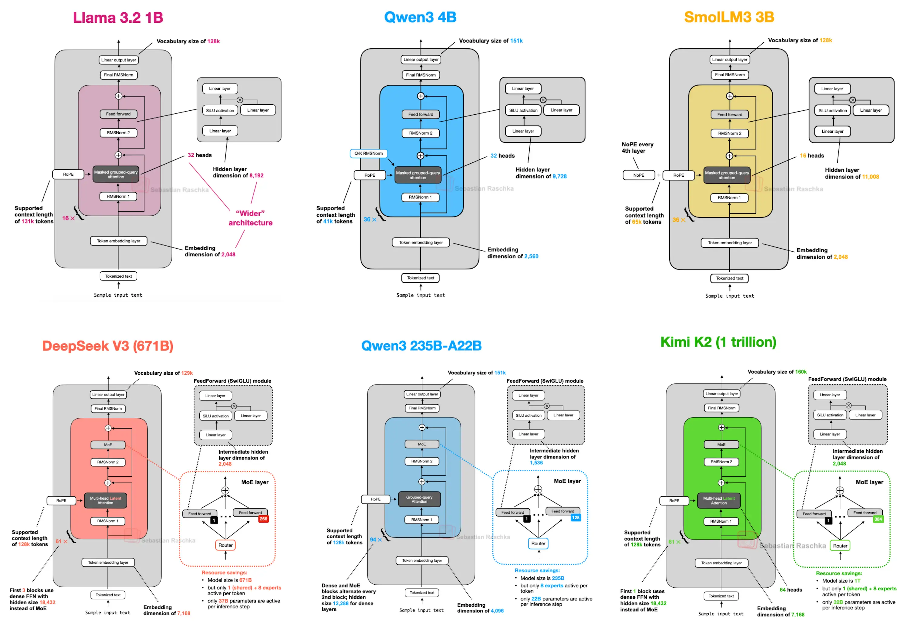
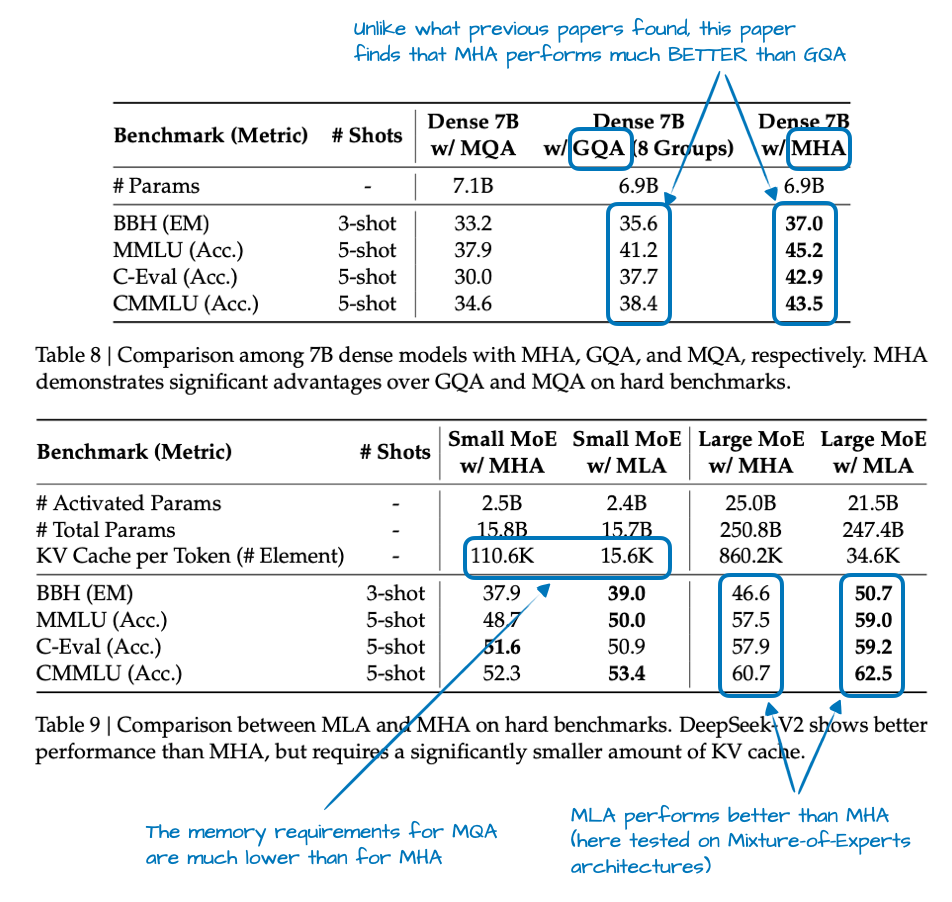
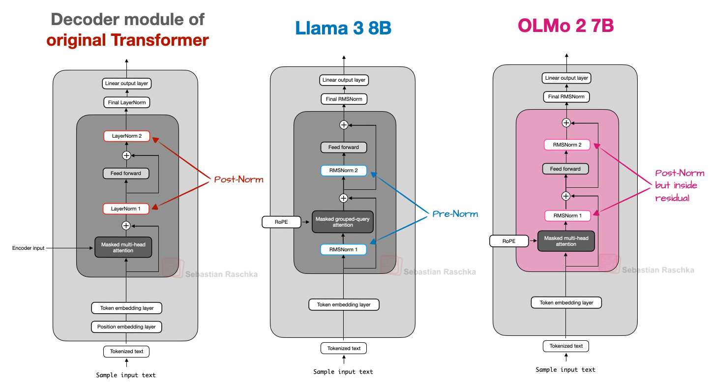
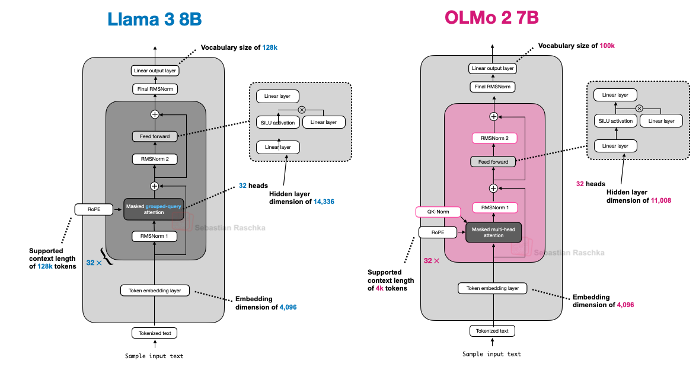
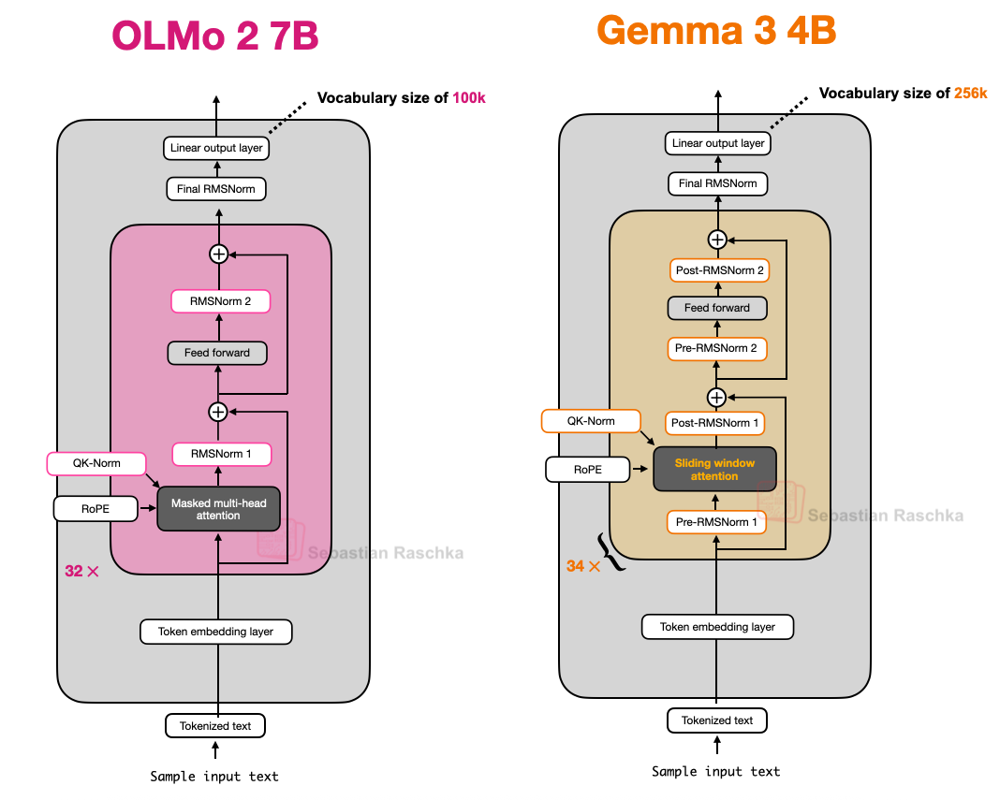
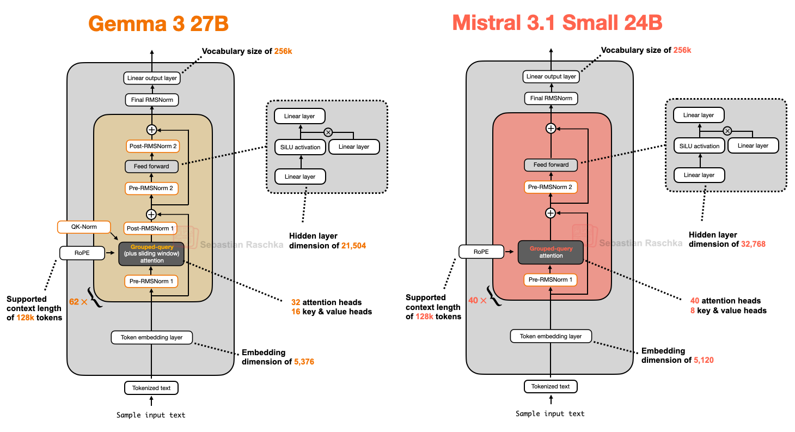
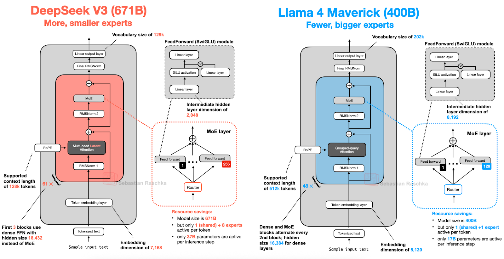
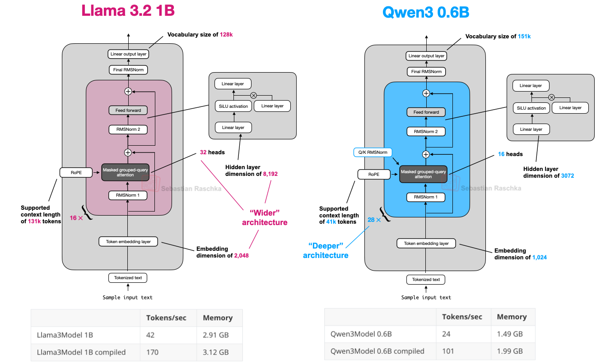
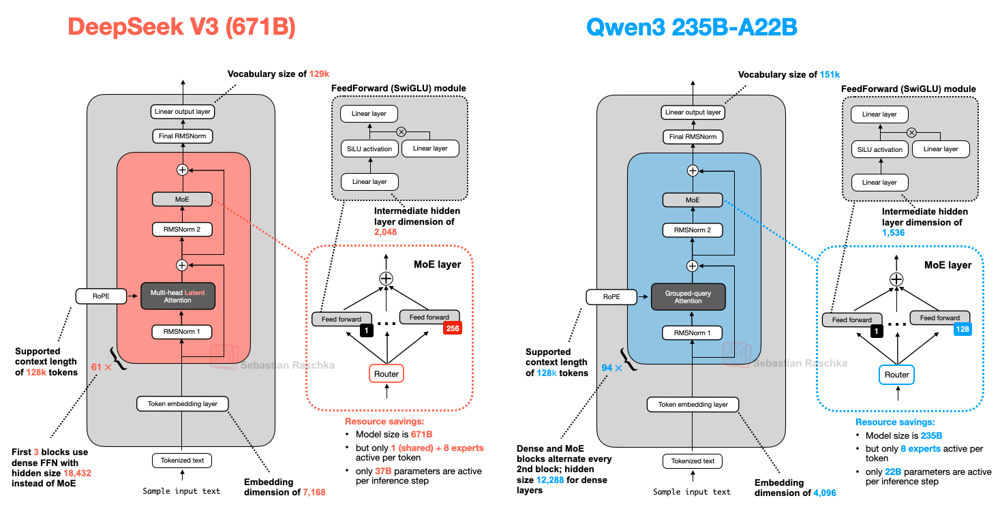
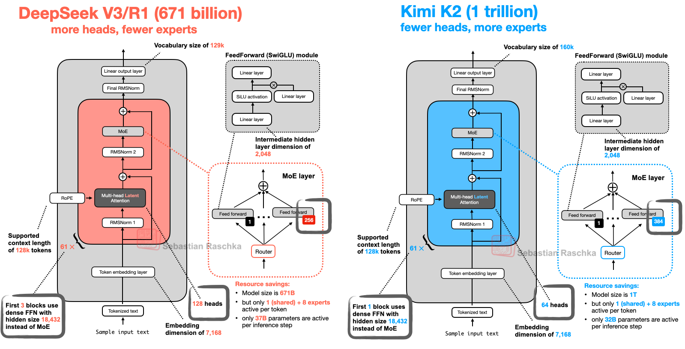

```
ref:
- https://sebastianraschka.com/blog/2025/the-big-llm-architecture-comparison.html
- https://magazine.sebastianraschka.com/p/understanding-multimodal-llms
```

大趋势：2025 年的 SOTA 开源模型 DeepSeek-V3 和 Llama 4 等，整体与 GPT-2 仍然有很高的相似度：
- positional embedding -> rotational (RoPE)
- Multi-Head Attention -> 大部分场景替换为 Grouped-Query Attention
- SwiGLU -> GELU

影响模型效果的关键因素没有详细说明：数据集、训练技巧、超参等




## 1. DeepSeek V3/R1

主要涉及两个模型结构特点：
- Multi-Head Latent Attention (MLA)
- Mixture-of-Experts (MoE)

### 1.1 MLA
最开始大家用 MHA，后边为了减少参数量/计算量/显存带宽，使用 GQA 来按组共享K、V。消融实验证明 GQA 具有与 MHA 相当的模型性能。

 MLA 提供了另外一种省显存/显存带宽的思路，且与 KV cache 可以很好的耦合。
 实验认为，GQA 性能弱于 MHA（Dense），而性能上 MLA 优于 MHA（MoE）。


MLA 将 KV tensors 压缩到低维空间，随后才写入 KV Cache。推理时，压缩的张量会首先被映射回原空间。
计算上会多一次矩阵乘，但是可以大幅节省显存。

### 1.2 MoE

MoE 结构中，将每个 Transformer block 中的 FeedForward module 替换为多个 expert layers，每个 expert layer 仍然是一个 FeedForward module。

通过 router 来控制，每个 token 每次只激活其中的很小一部分 expert。

DeepSeek-V3 的 MoE 设计中的一个特点：使用了一个共享专家。通用能力交给这个共享专家，其他专家可以有更多机会学习专业能力。


## 2. OLMo2

代码和数据全面开源，是开发 LLM 的一个很好的蓝图。在开源时，在 计算-性能图中是 pareto frontier。

模型结构上的主要特点：
- Normalization Layer Placement: RMSNorm layers, QK-norm

仍然使用 MHA，而不是 MLA 或 GQA。

### 2.1 Normalization Layer Placement

与 Llama, Gemma 等大多数 LLM 类似，把 LayerNorm 替换为 RMSNorm。可粗略认为是一个简化版的更少参数的 LayerNorm。

关键点是放置的位置：
- 原始 transformer 结构，在 attention 和 feeforward 后，各放置一个 normalization layer。（Post-LN 或者 Post-Norm）

GPT 和大多数 LLM 将 norm layer 放置在 attention 和 feedforward 之前。（Pre-LN or Pre-Norm）



Pre-LN 的优势：
- 初始化时，梯度表现更好
- 不需要精细的 lr warmup （Post-Norm 是需要的）

OLMo 2 的实现中，使用了 Post-Norm，但是与原始 transformer 有些区别：
- OLMo 2 中，norm layer 在 residual layers 内部（skip connections）

好处：训练的稳定性更好，更少尖刺（但是没做消融实验，耦合了 QK-Norm）


### 2.2 QK-Norm
> 不是 olmo 发明的，来自：2023 scaling vision transformers paper

是另外一个 RMSNorm layer，放置在 MHA 内部。在 QK 应用 RoPE 前，作用于 QK。


### 2.3 summary

OLMo 2 的结构上，将 RMSNorm 放置在 attention 和 feedforward 之后，在 attention mechanism 中加入额外的 RMSNorm（QK-Norm）。主要的提升在于训练的稳定性。

作为对比，OLMo 2 和 Llama 3 的结构极为相似，主要差异就是 norm layer placement：




## 3 Gemma 3

### 3.1 Sliding Window Attention
> LongFormer 2020 paper
用途：在长上下文的场景，大幅节省 KV Cache。

Gemma2 使用混合注意力机制：sliding window (local) + global attention (1:1)，每个 token 使用 4k-token window

Gemma3：5:1，每 5 个 sliding window attn layer 对应一个 global attn layer。1k-token window

根据消融实验，对模型效果影响非常小。

### 3.2 Normalization Layer Placement

同时使用 pre-norm 和 post-norm。
> 两次 norm，即便有所冗余，在整体参数量也占比非常小。
使用 RMSNorm。




### 3.4 Gemma 3n
端侧小模型。
Per-Layer Embedding (PLE) parameter layer:
- 只保留模型参数的子集在 GPU 显存
- token-layer specific embeddings 被放到 CPU / SSD。

MatFormer(Matryoshka Transformer):
- Gemma 3n 使用 a single shared LLM(transformer) arch, 可被切分为独立的小模型使用。
- 每个 slice 被训练为独立工作，推理时可以只运行需要的部分。 


## 4. Mistral Small 3.1

整体结构比较规整。有几个特性：
- 自定义 tokenizer，应该贡献了更短的推理 latency
- shrinking KV cache & layer count

Mistral 之前的系列使用了 sliding window attn，但是 3.1 上又回退到不使用它了，使用单纯的 GQA。
可能是由于 sliding window attn 相比于一些 global attn 的优化算法（flash attn 等），并没有显著的 latency 改善。




## Llama 4

与 DeepSeek V3 很像。
集成了多模态能力，本文没覆盖。

主要的区别：
- llama4 使用 GQA，ds-v3 使用 MLA
- ds-v3 参数量多 68%，激活参数量多一倍（37B vs 17B）
- llama4 使用少量的大专家（8k hidden，激活2个）（ds 2k hidden，激活9个）
- llama4 在 transformer block 间隔 1:1 使用 MoE 和 dense modules




## 6. Qwen3


### 6.1 Qwen3 dense

Qwen3 0.6B 相比于 Llama3 1B，整体更小，资源消耗更少，看起来更适合各类测试/学习任务。
但是层数更多，吞吐略小。




### 6.2 Qwen3 MoE

整体结构与 DS-V3 很像，主要的几个区别：
- Qwen3 没有使用共享专家（然而 Qwen2.5 其实是用了的）
> 没有明确的原因，主要基于推理优化的角度，去掉了它（带上它性能没有显著提升）
- Attn 使用 GQA



## 7. SmolLM3

不太出名，HF 训练的，3B 模型，开源了大量训练细节。
主要特点：NoPE （No Positional Embeddings），每四层有一个 NoPE


## 8. Kimi 2

使用 Muon optimizer 替换 AdamW。在这个规模上是第一个。


整体结构与 ds-v3 保持的非常一致，但是更大。
- 更多专家：256 -> 384
- 更少的 head：128 -> 64




