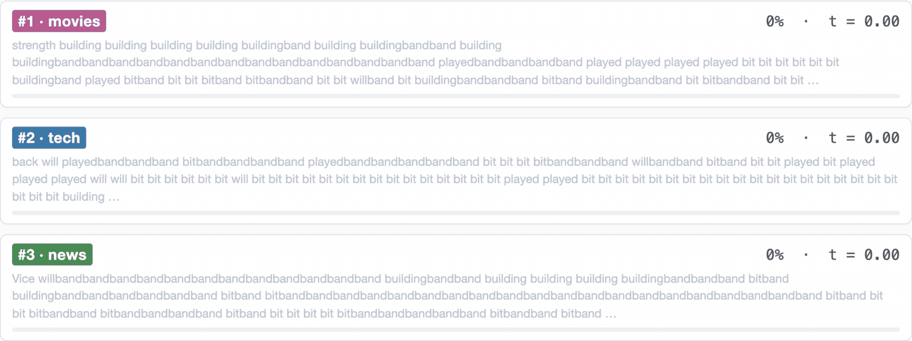
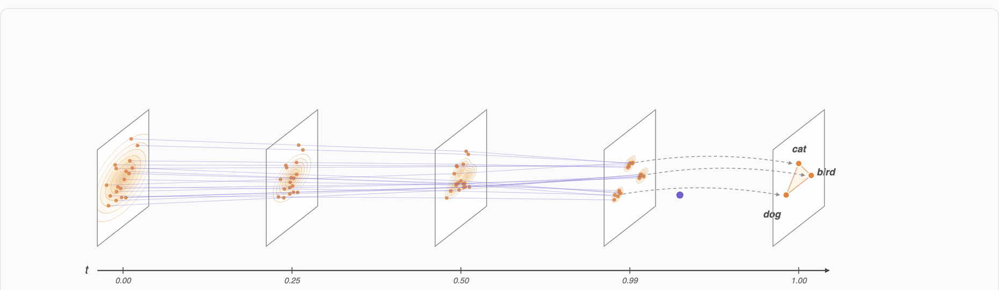
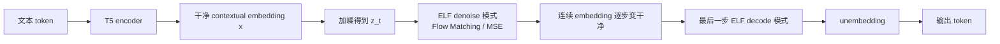
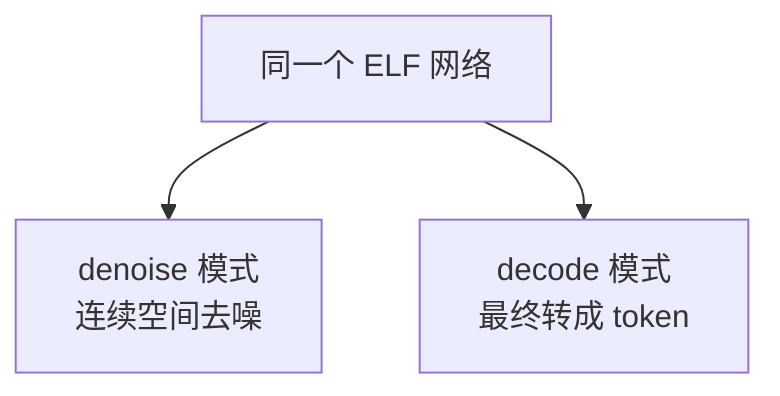
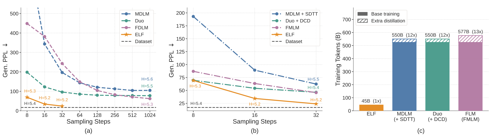

# ELF: Embedded Language Flows 读解报告

面向对象：AI 方向初学者  
整理日期：2026-05-13  
依据材料：机器之心文章、ELF 论文、官方 GitHub README

## 摘要

ELF 的全称是 **Embedded Language Flows**，中文可译为“嵌入式语言流”。它是一类基于 **Flow Matching** 的连续扩散语言模型。

这项工作的核心结论是：**连续扩散语言模型并不是走不通。只要把生成过程尽量保持在连续的 contextual embedding 空间里，并且只在最后一步离散化成 token，连续路线也可以在扩散语言模型赛道里取得很强效果。**

它的创新不是“第一次把扩散模型用于语言”，而是重新设计了连续扩散语言模型里最关键的接口问题：

> 文本最终必须输出离散 token，但生成过程是否必须一直受 token 空间约束？

ELF 的回答是：不必。中间过程可以在连续 embedding 空间里完成，最后一步再翻译成 token。

## 1. 背景：为什么语言扩散模型难做

扩散模型在图像、视频、音频生成中很成功，因为这些数据天然可以表示为连续数值。比如图像可以看作像素矩阵或 latent 向量，模型可以方便地做：

```text
干净图像 -> 加噪 -> 噪声
噪声 -> 去噪 -> 干净图像
```

但语言不同。语言表面上是离散 token：

```text
我 喜欢 机器 学习
```

模型词表里只有一个个编号，例如 `我=101`、`喜欢=2387`。token 之间没有“半个我”“三分之一喜欢”这种连续状态。

这就造成一个基本矛盾：

- 扩散/Flow 模型擅长连续空间。
- 文本输出必须是离散 token。

过去的扩散语言模型大致分成两条路线：

| 路线 | 代表思路 | 扩散过程主要发生在哪里 |
| --- | --- | --- |
| 离散 DLM | MASK、离散类别分布、token 替换 | token / MASK / categorical space |
| 连续 DLM | token embedding、simplex、latent 表示 | embedding 或连续松弛空间 |

ELF 属于第二条路线，但它对“连续”做得更彻底。

## 2. 初学者需要先理解：token 空间和 embedding 空间

### 2.1 token 空间是离散的

token 空间像一个词典。每个词或子词都有一个编号：

```text
token id:  [1287, 4269, 1523, ...]
```

编号之间没有自然的平滑路径。`1287` 和 `1288` 不一定语义相近。

### 2.2 embedding 空间是连续的

embedding 是一串实数向量：

```text
token embedding: [0.13, -0.42, 1.07, 0.08, ...]
```

向量可以加噪声、插值、移动和去噪。比如从一个随机向量逐步移动到一个代表句子语义的向量，是数学上自然的事情。

因此，所有 Transformer 语言模型内部都会用 embedding。问题不在于“有没有 embedding”，而在于：

> 扩散过程本身操作的是 token 状态，还是自由连续向量？

## 3. 之前的 DLM 是怎么做的

### 3.1 离散 DLM：扩散变量还是 token

以 masked diffusion language model 为例，它会把原句逐步 mask 掉，再训练模型恢复：

```text
原句：我 喜欢 机器 学习
加噪：我 [MASK] 机器 [MASK]
再噪：[MASK] [MASK] 机器 [MASK]
```

训练目标类似：

```text
输入：我 [MASK] 机器 [MASK]
输出：喜欢、学习
```

这类模型内部当然也会把 token id 变成 embedding，因为 Transformer 只能处理向量。但扩散变量本身仍是 token、MASK 或词表上的类别分布。

### 3.2 早期连续 DLM：用了 embedding，但中途常被词表拉住

另一类方法会做：

```text
token -> embedding -> 加高斯噪声 -> 去噪 embedding
```

这看上去和 ELF 很像。但很多前人方法会在中间步骤加入 token 级约束，例如：

- 每一步都预测词表分布，用 cross entropy 监督；
- 把中间向量 round 到最近的 token embedding；
- 用额外 loss 让中间状态贴近某个合法 token；
- 在 simplex 或 one-hot 的连续松弛空间里做，但状态仍接近词表分布。

所以它们“用了 embedding”，但生成轨迹经常像这样：

```text
连续向量 -> 检查它像不像某个 token -> 再继续去噪
```

ELF 认为这种中途离散化或 token 监督会限制连续扩散模型的自由度。

### 3.3 latent diffusion LM：连续 latent，但通常需要单独 decoder

还有一些方法把文本编码成 latent，再在 latent 空间扩散：

```text
token -> encoder -> latent
latent diffusion
latent -> separate decoder -> token
```

这条路也在连续空间里做生成，但通常要额外训练一个 decoder，把 latent 还原成文本。ELF 的设计目标之一就是避免这个额外模块。

## 4. ELF 的生成过程为什么是在连续 embedding 空间

ELF 的默认做法是先用一个冻结的 T5 encoder，把文本变成 contextual embeddings。这里的 contextual embedding 不只是单个 token 的查表向量，而是带上下文信息的连续表示。

训练时，给定干净 embedding `x` 和高斯噪声 `epsilon`，ELF 构造连续中间状态：

```text
z_t = t * x + (1 - t) * epsilon
```

其中：

- `t=0` 时，`z_t` 接近纯噪声；
- `t=1` 时，`z_t` 接近干净文本 embedding；
- 中间的 `z_t` 都是实数向量，不是 token id。

采样时，ELF 从随机噪声开始，沿着模型学到的速度场逐步走向干净 embedding：

```text
z0: 高斯噪声向量
z1: 稍微像文本 embedding 的向量
z2: 更像文本 embedding 的向量
...
zt: 接近干净文本 embedding
final: decode 成 token
```

在最后一步之前，ELF 不做以下操作：

- 不把中间状态 `argmax` 成 token；
- 不每一步预测词表分布；
- 不每一步用 token-level cross entropy 监督；
- 不用 nearest-neighbor rounding 强行贴近 token embedding。

这就是“生成过程在连续 embedding 空间”的含义。

官方仓库还给出了一个生成轨迹示意：随着时间 `t` 从 0 走到 1，文本从不成形的预测逐步被修正为更流畅的句子。这张图不是说模型每一步都已经输出最终 token，而是用可视化方式展示连续去噪过程带来的文本可读性提升。



## 5. ELF 的整体流程

官方仓库中的概念图展示了 ELF 的核心路径：橙色点表示连续 embedding 空间中的数据，紫色轨迹表示从噪声流向干净 embedding 的去噪过程，离散化只发生在最后一步。





ELF 的网络有两种模式：

| 模式 | 发生时间 | 学习目标 |
| --- | --- | --- |
| denoise | 大多数中间步骤 | 预测干净 embedding，用 MSE loss |
| decode | 最后一步 | 映射回 token，用 cross entropy loss |

训练时约 80% 的样本用于 denoise，20% 用于 decode。两个模式共用同一个网络，只靠 mode token 区分当前任务。

## 6. 相比前人，ELF 的核心创新点

### 6.1 把离散化推迟到最后一步

这是最关键的创新。前人很多连续 DLM 在中途就反复和 token 空间发生关系。ELF 则尽量保持中间轨迹自由连续：

```text
前人很多方法：
embedding -> 去噪 -> token 约束 -> 去噪 -> token 约束 -> ... -> token

ELF：
embedding -> 去噪 -> 去噪 -> 去噪 -> ... -> 最后一次变 token
```

这让 Flow Matching 能更像在图像生成中那样工作。

### 6.2 不需要单独 decoder

latent diffusion language model 往往需要额外 decoder。ELF 用同一个网络承担 denoiser 和 decoder 两个角色：



这样系统更简单，也避免额外训练阶段。

### 6.3 使用 continuous-time Flow Matching

ELF 不是传统 DDPM 式语言扩散，而是用连续时间 Flow Matching。直观理解，它学习的是从噪声流向干净 embedding 的“速度场”。

这带来的好处是：可以自然使用 ODE/SDE sampler，并且更接近现代图像/视频生成里的 flow-based 设计。

### 6.4 更自然地使用 CFG 和 self-conditioning

CFG 在图像扩散里很重要，用来控制生成质量和多样性。但在离散 token 空间里，CFG 不够自然。

ELF 中间状态是连续向量，所以 CFG 更容易搬过来。论文还把 self-conditioning 作为条件信号：模型上一轮预测的干净 embedding，会帮助下一轮预测。

## 7. 系统级实验结果

官方仓库给出的系统级对比如下：



图中要点可以概括为：

- ELF-B 约 105M 参数；
- 在 OpenWebText 无条件生成上，32 步 SDE 采样达到约 `Gen. PPL 24.1`；
- 使用约 `45.2B` effective training tokens；
- 对比的许多 DLM baseline 使用 `500B+` token 量级；
- ELF 不依赖额外 distillation，也能在少步采样下取得很强结果。

需要注意：机器之心原文中写到“320 步采样达到困惑度 24”，但论文和官方 README 均为 **32 steps**。这里应以论文和官方 README 为准。

## 8. 这份工作的核心结论

ELF 想回答的问题不是“扩散语言模型有没有人做过”。这个方向此前已经有很多工作。ELF 真正关心的是：

> 连续扩散语言模型过去效果不如离散 DLM，是因为语言本质上离散，还是因为连续路线设计得不够好？

论文的答案是：连续路线并不是天然不行。

更具体地说：

1. 如果中间生成轨迹尽量保持在连续 contextual embedding 空间；
2. 如果只在最后一步把 embedding 离散化成 token；
3. 如果用共享权重网络同时完成去噪和最终解码；
4. 如果引入 Flow Matching、self-conditioning、CFG 等连续生成技术；

那么连续 DLM 可以在中等规模实验中超过多种离散和连续 DLM baseline。

## 9. 初学者版总结

可以用三个模型类比来理解：

| 模型范式 | 类比 |
| --- | --- |
| 自回归 GPT | 从左到右逐字打字 |
| 离散 DLM | 在一排空格里反复填词、擦掉、再填 |
| ELF | 先形成一团连续的“句子语义草稿”，不断修清楚，最后翻译成文字 |

ELF 的核心差异是：

```text
前人往往在生成过程中反复回到 token/词表空间；
ELF 尽量把整个生成过程留在连续 embedding 空间；
最后一步才输出 token。
```

因此，ELF 的意义不是证明它已经能替代 GPT、Claude 或 Gemini 这类大规模自回归模型，而是证明：

> 在扩散语言模型这个研究赛道里，连续 embedding 路线重新变得有竞争力。

## 10. 资料来源

- 机器之心文章：<https://mp.weixin.qq.com/s/7x8w_2Ov-lpSEPRgqxLZBQ>
- 论文：ELF: Embedded Language Flows, arXiv:2605.10938, <https://arxiv.org/abs/2605.10938>
- 官方代码仓库：<https://github.com/lillian039/ELF>
- 本地材料：
  - `article_text.txt`
  - `ELF_Embedded_Language_Flows.pdf`
  - `ELF_README.md`
