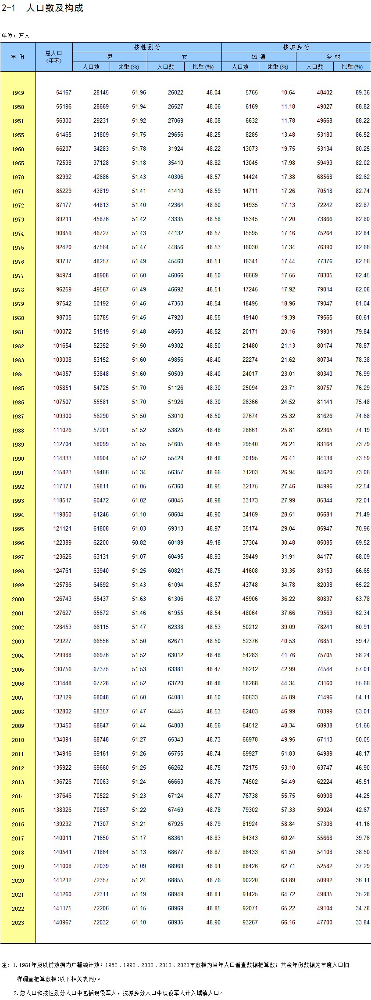

# 数据源: https://www.stats.gov.cn/sj/ndsj/2024/indexch.htm
一些额外的 insight，看起来从图片提取数据，相比于 chatgpt(4o)， claude (3.5-sonnet) 提取的更准确一些。
深入来说，想让模型完成严谨的任务，指令跟随能力非常重要，特别是在特定领域。看起来 claude 在这方面做了更多工作，训练数据的质量、模型对齐做的比较好。包括推理时计算，看起来 claude 会处理较长时间，一种推测是，这时 chat 服务可能在做一些推理时计算，包括多轮输出与反思，通过推理时的处理，让输出更符合预期。
不过看起来此类 OCR 任务，对算力的消耗还挺多的，等待时长可能会需要几分钟、十几分钟。

一些值得留意的结论：
- 55 岁以下，人口在五年的尺度内，自然减少 2% 到 3% 左右；
- 55-59 岁，人口在五年的尺度内，自然减少会达到 5% 左右；
- 过去十年期间，60-89 岁的人口，随着年龄增长，五年自然减少率没有大幅变化：
    - 例如，2014-2019 年，60-64 岁的自然减少在 7%，而 2019-2024 年，这批人进入了 65-69 岁的区间，自然减少仍然在 7% 左右；
    - 同样的，65-69 岁的人，2014-2019 年自然减少在 12%，而 2019-2024 年，这批人进入 70-74 岁的区间，自然减少仍然在 10% 左右；
    - 2014-2019 年 70-74 岁的人，自然减少在 19%，到 2019-2024 年在 18% 左右；
    - 2014-2019 年 75-79 岁的人，自然减少在 31%，到 2019-2024 年在 28% 左右；
    - 2014-2019 年 80-84 岁的人，自然减少在 47%，到 2019-2024 年在 44% 左右；
    - 2014-2019 年 85-89 岁的人，自然减少在 62%，到 2019-2024 年在 63% 左右；（估算）

一个不太靠谱的估算：
- 5 年后，2029 年：
    - 总人口变化不大，可能小幅下降 0.1-0.4 亿；
    - 25-59 岁人口从 7.3 亿减少为 6.7 亿；
        - 25-40 岁人口从 3 亿减少为 2.5 亿；
        - 40-59 岁人口从 4.3 亿减少为 4.2 亿；
    - 60 岁以上人口从 2.98 亿增加到 3.69 亿；占比从 21% 增加到 26%。
    - 80 岁以上人口从 0.40 亿增加到 0.56 亿；
    - 20岁以下人口从 3.1 亿减少到 2.7 亿；（误差可能比较大）
    - 按照 20-60 抚养 20 以下和 60 以上，抚养比从 0.76 增加到 0.86。
- 10 年后，2034 年：
    - 总人口变化不大，可能再度小幅下降 0.1-0.3 亿；
    - 60 岁以上人口从 3.69 亿增加到 4.4 亿；占比从 26% 增加到 33%；
    - 80 岁以上人口从 0.56 亿增加到 0.8 亿；
- 15 年后，2039 年：
    - 总人口可能再度小幅下降 0.1-0.4 亿；
    - 60 岁以上人口从 4.4 亿增加到 4.7 亿；占比从 33% 增加到 36%；
    - 80 岁以上人口从 0.8 亿增加到 1.0 亿；
    - 假设 20 岁以下人口在 2 亿，抚养比将增加到 1.0。


顺便对比一下延迟退休政策，2039 年，男性延迟到 63 岁退休，女性延迟到 55 岁 和 58 岁退休。
按退休人数，63 和 55 来算：
- 男性增加 0.36 亿不能领养老金，女性增加 0.4 亿不能领养老金；
- 仅按年龄算，使得 15 年后，养老金领取人数增加幅度（4.15 亿 - 4.73 亿）控制在 15% 左右，大约减少了一半新增养老金领取者。

## 人口数和构成
> gpt-4o 提取的不准确，下边是通过 claude 提取的，prompt: 
> 帮我提取这个图片中的表格的数据，以 csv 格式输出
> 


```csv
年份,总人口(年末),男-人口数,男-比重(%),女-人口数,女-比重(%),城镇-人口数,城镇-比重(%),乡村-人口数,乡村-比重(%)
1949,54167,28145,51.96,26022,48.04,5765,10.64,48402,89.36
1950,55196,28669,51.94,26527,48.06,6169,11.18,49027,88.82
1951,56300,29231,51.92,27069,48.08,6632,11.78,49668,88.22
1955,61465,31809,51.75,29656,48.25,8285,13.48,53180,86.52
1960,66207,34283,51.78,31924,48.22,13073,19.75,53134,80.25
1965,72538,37128,51.18,35410,48.82,13045,17.98,59493,82.02
1970,82992,42648,51.43,40396,48.57,14424,17.38,68568,82.62
1971,85229,43819,51.41,41410,48.59,14711,17.26,70518,82.74
1972,87177,44813,51.40,42364,48.60,14935,17.13,72242,82.87
1973,89211,45876,51.42,43335,48.58,15345,17.20,73866,82.80
1974,90859,46727,51.43,44132,48.57,15595,17.16,75264,82.84
1975,92420,47564,51.47,44856,48.53,16030,17.34,76390,82.66
1976,93717,48257,51.49,45460,48.51,16341,17.44,77376,82.56
1977,94974,48908,51.50,46066,48.50,16669,17.55,78305,82.45
1978,96259,49567,51.49,46692,48.51,17245,17.92,79014,82.08
1979,97542,50192,51.46,47350,48.54,18495,18.96,79047,81.04
1980,98705,50785,51.45,47920,48.55,19140,19.39,79565,80.61
1981,100072,51519,51.48,48553,48.52,20171,20.16,79901,79.84
1982,101654,52352,51.50,49302,48.50,21480,21.13,80174,78.87
1983,103008,53152,51.60,49856,48.40,22274,21.62,80734,78.38
1984,104357,53848,51.60,50509,48.40,24017,23.01,80340,76.99
1985,105851,54725,51.70,51126,48.30,25094,23.71,80757,76.29
1986,107507,55581,51.70,51926,48.30,26366,24.52,81141,75.48
1987,109300,56290,51.50,53010,48.50,27674,25.32,81626,74.68
1988,111026,57201,51.52,53825,48.48,28661,25.81,82365,74.19
1989,112704,58099,51.55,54605,48.45,29540,26.21,83164,73.79
1990,114333,58904,51.52,55429,48.48,30195,26.41,84138,73.59
1991,115823,59466,51.34,56357,48.66,31203,26.94,84620,73.06
1992,117171,59811,51.05,57360,48.95,32175,27.46,84996,72.54
1993,118517,60472,51.02,58045,48.98,33173,27.99,85344,72.01
1994,119850,61246,51.10,58604,48.90,34169,28.51,85681,71.49
1995,121121,61808,51.03,59313,48.97,35174,29.04,85947,70.96
1996,122389,62200,50.82,60189,49.18,37304,30.48,85085,69.52
1997,123626,63131,51.07,60495,48.93,39449,31.91,84177,68.09
1998,124761,63940,51.25,60821,48.75,41608,33.35,83153,66.65
1999,125786,64692,51.43,61094,48.57,43748,34.78,82038,65.22
2000,126743,65437,51.63,61306,48.37,45906,36.22,80837,63.78
2001,127627,65672,51.46,61955,48.54,48064,37.66,79563,62.34
2002,128453,66115,51.47,62338,48.53,50212,39.09,78241,60.91
2003,129227,66556,51.50,62671,48.50,52376,40.53,76851,59.47
2004,129988,66976,51.52,63012,48.48,54283,41.76,75705,58.24
2005,130756,67375,51.53,63381,48.47,56212,42.99,74544,57.01
2006,131448,67728,51.52,63720,48.48,58288,44.34,73160,55.66
2007,132129,68048,51.50,64081,48.50,60633,45.89,71496,54.11
2008,132802,68357,51.47,64445,48.53,62403,46.99,70399,53.01
2009,133450,68647,51.44,64803,48.56,64512,48.34,68938,51.66
2010,134091,68748,51.27,65343,48.73,66978,49.95,67113,50.05
2011,134916,69161,51.26,65755,48.74,69927,51.83,64989,48.17
2012,135922,69660,51.25,66262,48.75,72175,53.10,63747,46.90
2013,136726,70063,51.24,66663,48.76,74502,54.49,62224,45.51
2014,137646,70522,51.23,67124,48.77,76738,55.75,60908,44.25
2015,138326,70857,51.22,67469,48.78,79302,57.33,59024,42.67
2016,139232,71307,51.21,67925,48.79,81924,58.84,57308,41.16
2017,140011,71650,51.17,68361,48.83,84343,60.24,55668,39.76
2018,140541,71864,51.13,68677,48.87,86433,61.50,54108,38.50
2019,141008,72039,51.09,68969,48.91,88426,62.71,52582,37.29
2020,141212,72357,51.24,68855,48.76,90220,63.89,50992,36.11
2021,141260,72311,51.19,68949,48.81,91425,64.72,49835,35.28
2022,141175,72206,51.15,68969,48.85,92071,65.22,49104,34.78
2023,140967,72032,51.10,68935,48.90,93267,66.16,47700,33.84
```


## 按年龄和性别分人口数

### 2024 年报表
> 2023年数据，抽样比：0.1051%

```csv
年龄,人口数(人),男,女,占总人口比重(%),男比重(%),女比重(%),性别比(女=100)
合计,1482230,756458,725772,100.00,51.04,48.96,104.23
0-4岁,57537,30045,27492,3.88,2.03,1.85,109.28
5-9岁,90498,47754,42744,6.11,3.22,2.88,111.72
10-14岁,94775,50567,44208,6.39,3.41,2.98,114.39
15-19岁,85813,45956,39858,5.79,3.10,2.69,115.30
20-24岁,73696,39213,34483,4.97,2.65,2.33,113.72
25-29岁,84358,44602,39756,5.69,3.01,2.68,112.19
30-34岁,113258,58895,54362,7.64,3.97,3.67,108.34
35-39岁,118381,60757,57624,7.99,4.10,3.89,105.44
40-44岁,101291,51953,49338,6.83,3.51,3.33,105.30
45-49岁,102401,52120,50281,6.91,3.52,3.39,103.66
50-54岁,126579,63944,62634,8.54,4.31,4.23,102.09
55-59岁,120926,60470,60456,8.16,4.08,4.08,100.02
60-64岁,84465,41879,42585,5.70,2.83,2.87,98.34
65-69岁,81497,40202,41295,5.50,2.71,2.79,97.35
70-74岁,64545,31014,33532,4.35,2.09,2.26,92.49
75-79岁,39405,18568,20837,2.66,1.25,1.41,89.11
80-84岁,23624,10616,12907,1.59,0.72,0.87,82.25
85-89岁,13443,5662,7781,0.91,0.38,0.52,72.77
90-94岁,4885,1904,2981,0.33,0.13,0.20,63.86
95岁及以上,953,334,619,0.06,0.02,0.04,53.92
```

### 2019 年报表
> 2018年数据，抽样比：0.0832%


```csv
年龄,人口数(人),男,女,占总人口比重(%),男比重(%),女比重(%),性别比(女=100)
总计,1144648,585299,559349,100.00,51.13,48.87,104.64
0-4,67393,35887,31506,5.89,3.14,2.75,113.91
5-9,63322,34279,29043,5.53,2.99,2.54,118.03
10-14,62248,33775,28473,5.44,2.95,2.49,118.62
15-19,58258,31552,26706,5.09,2.76,2.33,118.14
20-24,68050,36085,31965,5.95,3.15,2.79,112.89
25-29,92977,47710,45268,8.12,4.17,3.95,105.39
30-34,93201,46843,46358,8.14,4.09,4.05,101.05
35-39,81886,41517,40370,7.15,3.63,3.53,102.84
40-44,83574,42557,41017,7.30,3.72,3.58,103.75
45-49,102384,52108,50276,8.94,4.55,4.39,103.64
50-54,96850,48939,47911,8.46,4.28,4.19,102.15
55-59,69844,35208,34636,6.10,3.08,3.03,101.65
60-64,68014,34092,33923,5.94,2.98,2.96,100.50
65-69,54799,26974,27825,4.79,2.36,2.43,96.94
70-74,34810,16905,17905,3.04,1.48,1.56,94.42
75-79,22799,10745,12054,1.99,0.94,1.05,89.15
80-84,14845,6457,8389,1.30,0.56,0.73,76.97
85-89,6902,2870,4033,0.60,0.25,0.35,71.16
90-94,2031,665,1365,0.18,0.06,0.12,48.74
95+,458,131,327,0.04,0.01,0.03,40.07
```

### 2014 年报表
> 2013年数据，抽样比：0.0822%


```csv
年龄,人口数(人),男,女,占总人口比重(%),男比重(%),女比重(%),性别比(女=100)
总计,1118433,573428,545005,100.00,51.27,48.73,105.22
0-4,63490,34273,29218,5.68,3.06,2.61,117.30
5-9,62446,33890,28556,5.58,3.03,2.55,118.68
10-14,57562,31141,26422,5.15,2.78,2.36,117.86
15-19,68715,36177,32538,6.14,3.23,2.91,111.18
20-24,97406,50961,46446,8.71,4.56,4.15,109.72
25-29,93136,46693,46443,8.33,4.17,4.15,100.54
30-34,82677,41986,40691,7.39,3.75,3.64,103.18
35-39,84334,43057,41277,7.54,3.85,3.69,104.31
40-44,103771,53017,50753,9.28,4.74,4.54,104.46
45-49,98129,49884,48245,8.77,4.46,4.31,103.40
50-54,69533,35355,34178,6.22,3.16,3.06,103.44
55-59,70719,35892,34827,6.32,3.21,3.11,103.06
60-64,58256,29230,29026,5.21,2.61,2.60,100.70
65-69,39216,19577,19638,3.51,1.75,1.76,99.69
70-74,27905,13748,14157,2.49,1.23,1.27,97.11
75-79,21253,10054,11199,1.90,0.90,1.00,89.78
80-84,12769,5759,7011,1.14,0.51,0.63,82.14
85-89,5256,2104,3152,0.47,0.19,0.28,66.75
90-94,1558,555,1003,0.14,0.05,0.09,55.33
95+,304,77,227,0.03,0.01,0.02,34.05
```